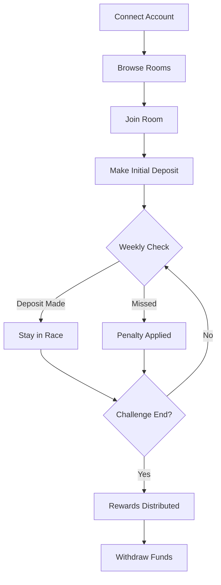

# How It Works

This section explains the complete user journey from signing up to earning rewards.

---

## 🚀 Getting Started

### Step 1: Connect Your Account

You have two options to get started:

```
┌─────────────────────────────────────────┐
│  Welcome to Money Race                   │
│                                         │
│  ┌─────────────────────────────────┐    │
│  │  Sign in with Google            │    │
│  └─────────────────────────────────┘    │
│                                         │
│              ─── OR ───                 │
│                                         │
│  ┌─────────────────────────────────┐    │
│  │  Connect Sui Wallet             │    │
│  └─────────────────────────────────┘    │
└─────────────────────────────────────────┘
```

**Google Login (zkLogin):**
- Uses Sui's zkLogin technology
- No wallet needed to start
- Automatic keypair generation

**Wallet Connect:**
- Direct Sui wallet integration
- Full control of your keys
- Supports popular Sui wallets

---

### Step 2: Browse Savings Rooms

Explore available rooms on the dashboard:

| Room Info | Example |
|-----------|---------|
| Name | "Weekend Warriors" |
| Duration | 8 weeks |
| Weekly Target | $50 USDC |
| Participants | 15/20 |
| Prize Pool | $200 |
| Strategy | Balanced |

---

### Step 3: Join a Room

1. Select a room that matches your goals
2. Review the room parameters
3. Choose your AI-recommended strategy (or pick your own)
4. Make your initial deposit
5. You're in the race! 🏁

---

### Step 4: Weekly Deposits

Each week, make your deposit to stay in the race:

```
Week 1: ✅ $50 deposited
Week 2: ✅ $50 deposited
Week 3: ⏳ Pending (2 days left)
Week 4: 🔒 Locked
```

**Deposit Window:** You have 7 days each week to make your deposit.

**Grace Period:** If you miss the deadline, a penalty applies.

---

### Step 5: Track Your Progress

Monitor your performance on the dashboard:

- **Savings Progress** – Total saved vs target
- **Race Position** – Your rank in the room
- **Streak Counter** – Consecutive weeks saved
- **Projected Rewards** – Estimated earnings

---

### Step 6: Earn Rewards 🏆

At the end of the challenge:

```
Challenge Complete!

Your Stats:
├── Total Saved: $400
├── Weeks Completed: 8/8
├── Final Position: 2nd
└── Rewards Earned: $45 USDC

Total Payout: $445 USDC
```

---

## 📊 Flow Diagram



---

## Technical Flow

For developers, here's the technical flow:

1. **Authentication** → zkLogin or wallet signature
2. **Room Join** → Smart contract call with deposit
3. **Weekly Deposit** → Transfer USDC to contract
4. **Progress Update** → Contract state update
5. **Reward Calculation** → On-chain logic
6. **Distribution** → Automatic payout

---

[Next: Savings Rooms →](savings-rooms.md)
