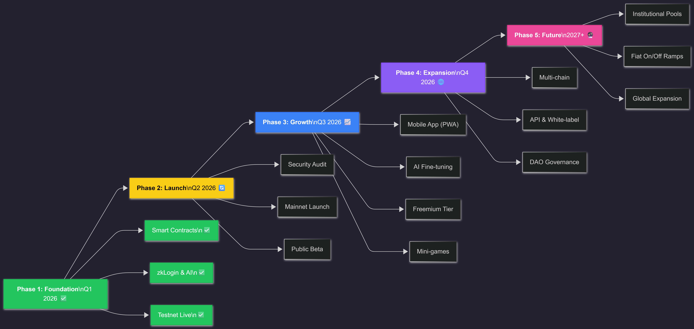

# Roadmap

## Vision

Money Race aims to become the leading gamified savings protocol on Sui blockchain, expanding to multi-chain and building a global community of disciplined savers.

---

## Timeline

---

### ✅ Phase 1: Foundation (Q1 2026) — Completed

- [x] Core smart contract development
- [x] Frontend MVP (Next.js)
- [x] Sui wallet integration
- [x] zkLogin (Google OAuth)
- [x] Basic room functionality
- [x] AI strategy recommendation MVP
- [x] Testnet deployment

---

### 🔄 Phase 2: Launch (Q2 2026) — In Progress

- [x] Security audit
- [x] Mainnet deployment
- [ ] Public beta launch
- [ ] Community building
- [ ] First 100 rooms created
- [ ] Partnership announcements

---

### 📈 Phase 3: Growth & Monetization (Q3 2026) — Planned

- [ ] Mobile app (PWA)
- [ ] NFT achievement badges
- [ ] **AI Model Fine-tuning** — Train on Sui DeFi datasets
  - Historical protocol APY data (Scallop, Navi, Cetus)
  - User savings behavior patterns
  - Market condition correlations
  - Yield optimization models
- [ ] **Freemium Tier System**
  - Free Tier: 3 rooms max, 3 AI recommendations/month
  - Premium Tier: Unlimited rooms, unlimited AI, priority features
  - Subscription payments in USDC (monthly/yearly)
- [ ] Room discovery algorithm
- [ ] Social features (friends, invites)
- [ ] Referral program
- [ ] **Mini-Games Launch**
  - Savings Slots (no-loss lottery)
  - Streak challenges
  - Leaderboard tournaments

---

### 🌐 Phase 4: Expansion (Q4 2026) — Planned

- [ ] Multi-token support (beyond USDC)
- [ ] Cross-chain integration
- [ ] Advanced analytics dashboard
- [ ] API for third-party integration
- [ ] White-label solution
- [ ] DAO governance

---

### 🔮 Phase 5: Future (2027+) — Vision

- [ ] Institutional savings pools
- [ ] Fiat on/off ramps
- [ ] Global expansion (localization)
- [ ] Advanced yield strategies
- [ ] Insurance integration
- [ ] Enterprise solutions

---

## Key Metrics Targets

| Metric | Q2 2026 | Q4 2026 | 2027 |
|--------|---------|---------|------|
| Total Users | 1,000 | 10,000 | 100,000 |
| Active Rooms | 100 | 1,000 | 10,000 |
| TVL | $100K | $1M | $10M |
| Chains | 1 | 3 | 5+ |

---

## 🎯 Community Milestones

- **1,000 users** → Community NFT drop
- **10,000 users** → Governance token launch
- **$1M TVL** → Protocol revenue sharing

---

[Back to Mission →](README.md)
